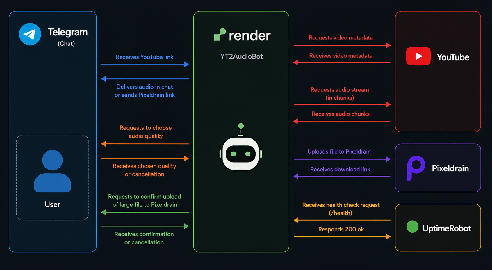
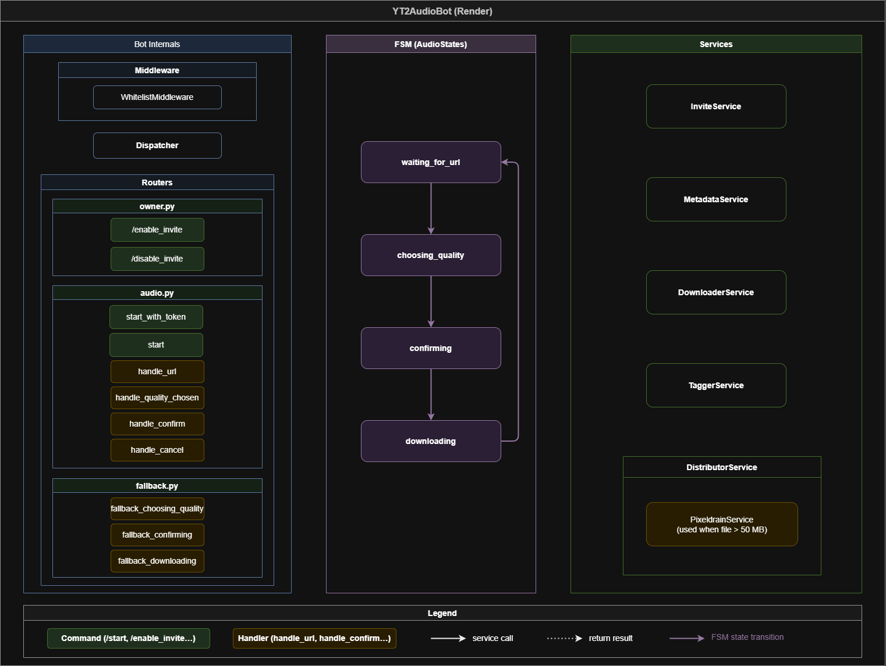
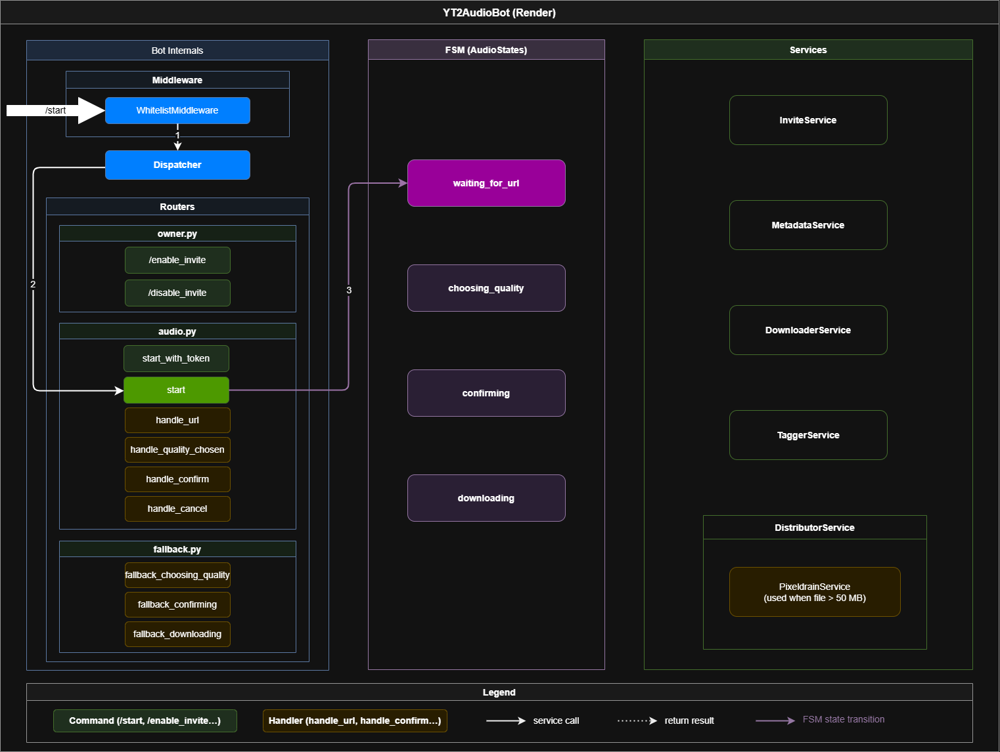
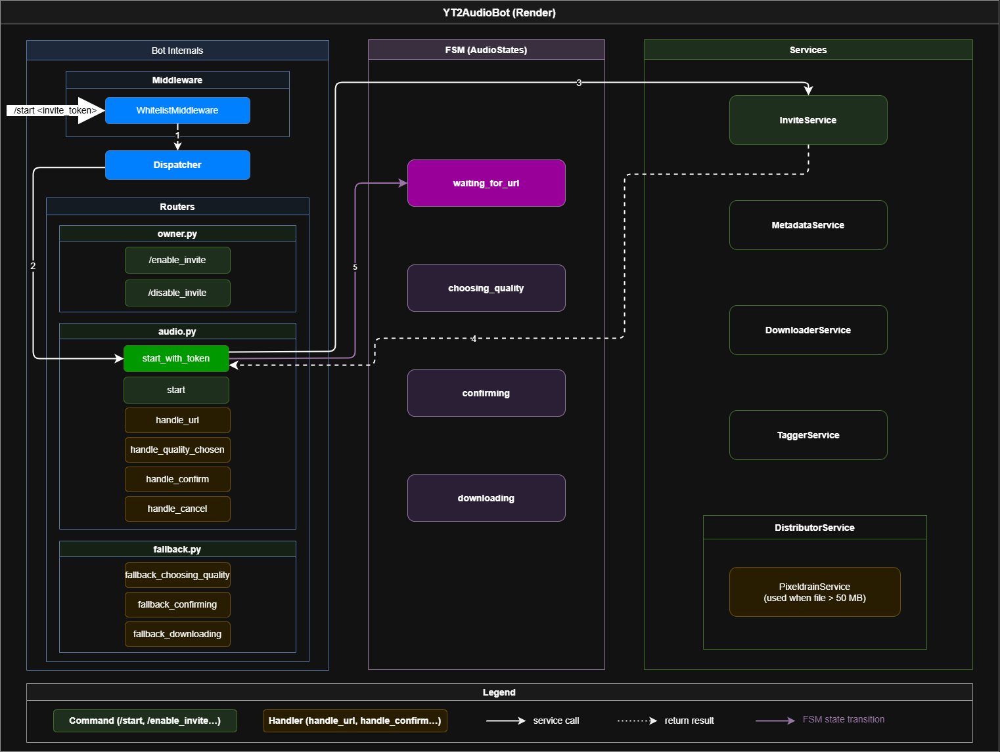
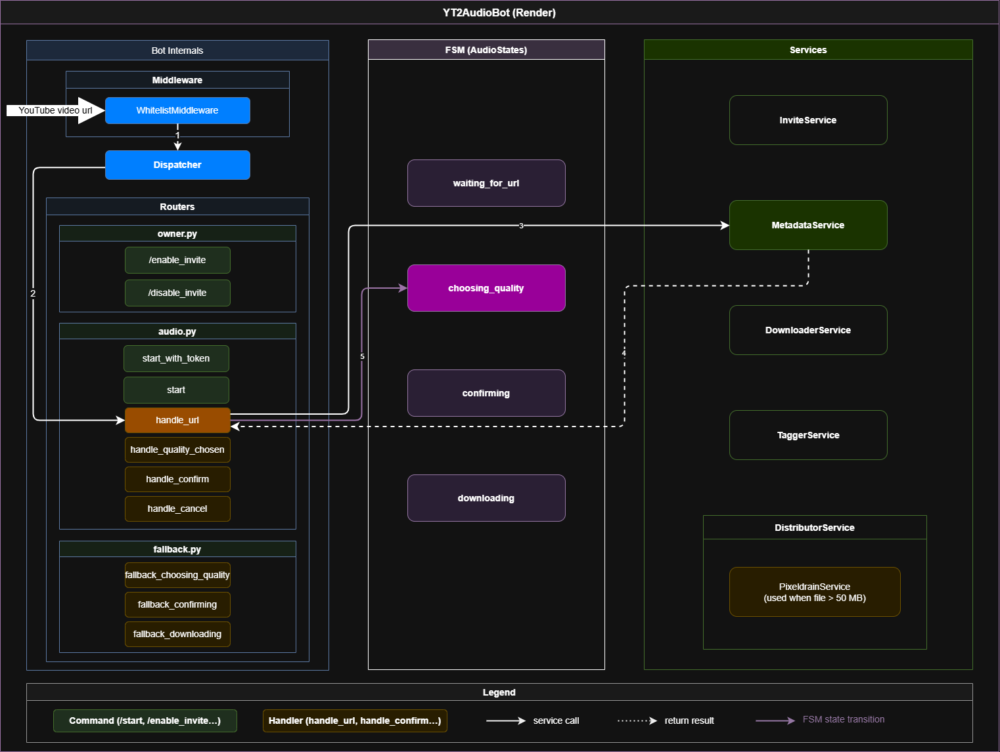
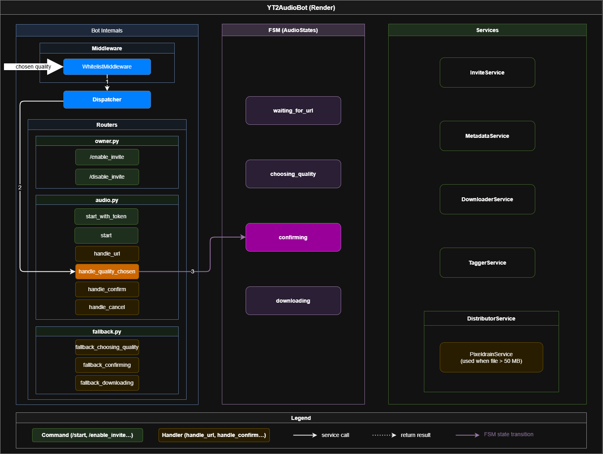
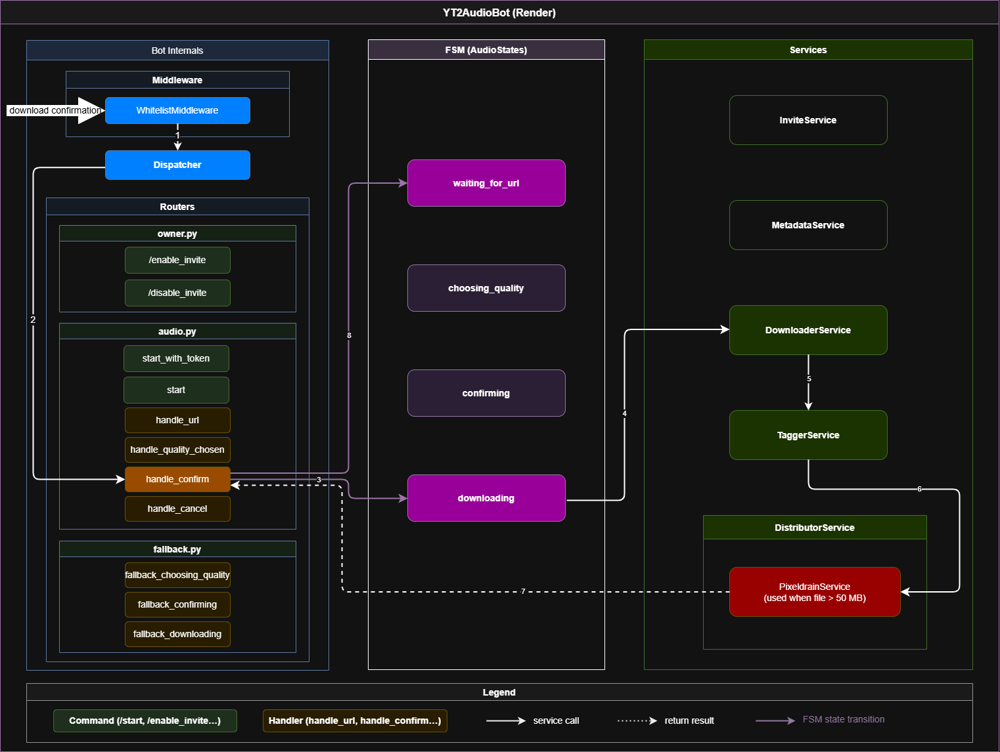

# Architecture

## Overview

YT2AudioBot is a free self-hosted Telegram bot that extracts audio from YouTube videos and delivers it to the user — either directly to Telegram chat or via a Pixeldrain link for larger files.

The bot is built with Python 3.12 and [aiogram 3](https://docs.aiogram.dev/en/latest/), runs as a webhook server on [Render](https://render.com), and uses [yt-dlp](https://github.com/yt-dlp/yt-dlp) under the hood for downloading. It is designed as a personal tool, though it can comfortably accommodate 2–3 additional users within the constraints of free-tier services, as long as usage remains reasonable.

Access is controlled via a static whitelist of Telegram user IDs. The bot owner can also generate invite links that grant temporary 24-hour access — intended primarily for demonstrating the bot to others rather than for permanent onboarding.

The bot is intentionally minimal: no database, no persistent storage, no background workers. State is kept in memory for the duration of a user session.

---

## External Services

YT2AudioBot interacts with four external services:

**Telegram** is the primary interface. Users interact with the bot via chat messages and inline keyboard buttons. The bot receives updates via webhook and sends audio files or Pixeldrain links back to the chat.

**YouTube** is the content source. The bot requests video metadata (title, available formats, estimated file sizes) and then streams audio in chunks via yt-dlp.

**Pixeldrain** is used as a fallback delivery method when the downloaded file exceeds 50 MB — Telegram's bot API limit for sending files. The bot uploads the file to Pixeldrain and sends the user a download link instead.

**UptimeRobot** is an optional but recommended addition. Render's free tier spins down containers after 15 minutes of inactivity, causing the first request after a cold start to take 30–60 seconds. UptimeRobot can be configured to ping the bot's `/health` endpoint at regular intervals to keep it alive.

---

## Bot Internals

The bot is structured around three main components: Bot Internals, FSM, and Services.

**Bot Internals** contains the aiogram machinery. Incoming updates first pass through `WhitelistMiddleware`, which checks whether the user has access — either via the static whitelist or an active invite session. Approved updates are forwarded to the `Dispatcher`, which routes them to one of three routers:

- `owner.py` handles owner-only commands: `/enable_invite` and `/disable_invite`
- `audio.py` is the main router — it handles the full user interaction flow from URL submission to audio delivery
- `fallback.py` catches any message or callback that doesn't match the current FSM state and responds with a contextual hint

**FSM (AudioStates)** tracks where each user is in the interaction flow. The bot uses four states: `waiting_for_url`, `choosing_quality`, `confirming`, and `downloading`. Transitions between states are driven by handlers in `audio.py`.

**Services** contain the business logic, each responsible for a single concern:

- `InviteService` — manages invite link state and temporary access sessions
- `MetadataService` — fetches video metadata from YouTube via yt-dlp
- `DownloaderService` — downloads audio from YouTube via yt-dlp
- `TaggerService` — writes ID3 tags (title, source URL) to the downloaded file
- `DistributorService` — decides delivery method based on file size; delegates to `PixeldrainService` for files over 50 MB

---

## Access Control

Access to the bot is restricted by `WhitelistMiddleware`, which intercepts every incoming update before it reaches the dispatcher.

Users are allowed through if they appear in the static whitelist (`ALLOWED_USER_IDS`) or have an active invite session granted via an invite link.

The following diagrams show both access flows.

**Whitelist flow** — an existing whitelisted user sends `/start`. The middleware approves the request, the dispatcher routes it to the `start` handler, which sets the FSM to `waiting_for_url`.

**Invite flow** — a new user follows an invite link (`/start <invite_token>`). The middleware approves the request, the dispatcher routes it to `start_with_token`, which validates the token, calls `InviteService` to register the session, and sets the FSM to `waiting_for_url`. Invite sessions expire after 24 hours.

Token validation is intentionally handled by the handler, not the middleware. The middleware has a single responsibility: deciding whether a user already has access. A user arriving via invite link does not have access yet — the middleware lets them through, and the handler takes over. Keeping these concerns separate makes each component easier to reason about and test independently.

---

## Request Flows

The diagrams below show the full happy path for each flow — the longest possible chain of steps without cancellation or errors.

**URL processing** — the user sends a YouTube URL. The handler calls `MetadataService` to fetch video metadata, then sets the FSM to `choosing_quality` and presents the user with available quality options.

**Quality selection** — the user selects a quality option. If the selected format is webm or the estimated file size exceeds 50 MB, the handler sets the FSM to `confirming` and asks the user to confirm before proceeding. For webm, the confirmation also serves as a warning: the format may not play on iOS without third-party apps. For large files, it warns the user that the file will be uploaded to Pixeldrain rather than sent directly to chat.

**Download & delivery** — the user confirms. The handler sets the FSM to `downloading`, then sequentially calls `DownloaderService`, `TaggerService`, and `DistributorService`. If the file exceeds 50 MB, `DistributorService` delegates to `PixeldrainService`. On completion, the handler sets the FSM back to `waiting_for_url`.

---

## Owner Commands

The bot owner has access to two commands: `/enable_invite` and `/disable_invite`. Both are handled by `owner.py` and delegate directly to `InviteService`.

By default, invite access is enabled. The owner can disable it at any time — new invite links will be rejected, while existing active sessions remain unaffected until they expire.

Invite links are intended for demonstration purposes: to show the bot to someone without adding them to the permanent whitelist. Each time a new user gains access via an invite link, the bot notifies the owner with the user's Telegram username, user ID, and session expiry time.

Since the bot has no persistent storage, there is no way to automatically enforce usage limits on invite sessions. If the owner sees that an invite link is being used for ongoing access rather than one-time demonstration, the owner can disable invite access manually via `/disable_invite`.

---

## Fallback Handlers

`fallback.py` contains handlers that catch any message or callback that doesn't match the current FSM state. There is one fallback handler per state: `fallback_choosing_quality`, `fallback_confirming`, and `fallback_downloading`.

Their purpose is to prevent silent failures when a user sends an unexpected message mid-flow — for example, typing text while the bot is waiting for a quality selection button press. Instead of ignoring the input, the fallback responds with a contextual hint reminding the user what action is expected at that stage.

From any state, the user can also cancel the current operation entirely via the cancel button, which returns the FSM to `waiting_for_url`.

---

## Key Implementation Decisions

**Download runs in a thread pool executor**

yt-dlp is a synchronous library. Running it directly in an async handler would block the event loop for the duration of the download, making the bot unresponsive to all other users. To avoid this, `DownloaderService` runs the yt-dlp call in a thread pool executor via `asyncio.get_event_loop().run_in_executor()`, keeping the event loop free while the download proceeds in a separate thread.

**Progress bar via a background watcher**

While the download runs in the executor, a separate async task (`_progress_watcher`) polls a shared `DownloadProgress` object at a configurable interval (`PROGRESS_BAR_INTERVAL_SEC`, default 2 seconds) and edits the bot message in chat to reflect current download progress. This gives the user live feedback without blocking the download itself. The progress object is also used to propagate a cancellation signal from the handler back to the yt-dlp thread.

**No ffmpeg dependency**

The bot deliberately avoids ffmpeg for audio processing. ffmpeg is commonly used with yt-dlp for format conversion and post-processing, but it is memory- and CPU-intensive — a risk on Render's free tier with only 512 MB RAM. Instead, the bot requests formats that require no conversion: m4a or mp3 are preferred and downloaded as-is. webm is used only as a last resort when neither m4a nor mp3 is available, and the user is warned upfront that playback may not work on iOS. This keeps resource usage predictable and avoids OOM crashes during post-processing.

**In-memory invite sessions**

Invite sessions are stored in a plain Python dict in `InviteService`. There is no database or persistent storage. This keeps the implementation simple but means all active sessions are lost on container restart — users who had temporary access will need to use the invite link again.

---

## Notes

**No download queue.** Concurrent downloads from multiple users run in parallel without any rate limiting. On Render's free tier (512 MB RAM), simultaneous heavy downloads may cause an out-of-memory crash and container restart. This is one of the reasons the bot is recommended for 2–3 whitelist users at most — the other being Render's 6 GB monthly outbound traffic limit.

**Sessions are lost on restart.** Invite sessions are stored in memory. A container restart — whether due to a crash, redeployment, or Render spinning down the instance — clears all active sessions. Affected users will need to use the invite link again to regain access.

**Single invite token.** All invite links share the same token defined in `INVITE_TOKEN`. It is not possible to issue separate tokens for different people or revoke access for a specific user without disabling invite access entirely.
